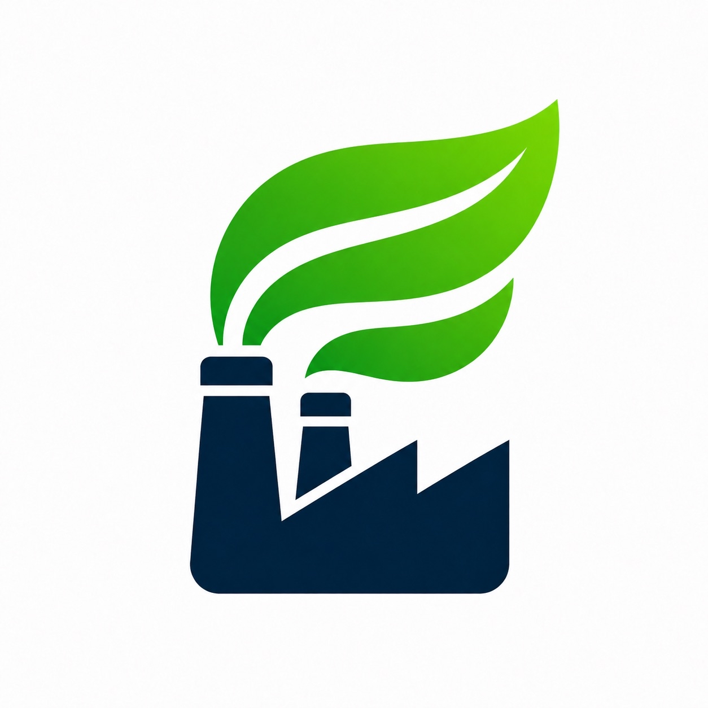

  

<h1 align="center">OptiZero</h1>

  
  
  
  
  

ESG compliance isn't just reporting; it's a resource allocation problem. OptiZero is a **multi-site product mix optimizer** that tells manufacturers what to produce, where to produce it, and what profit/compliance trade-off that decision creates.

The production plan is generated by deterministic linear programming, not an LLM.

---

Devpost submission: [OptiZero](https://devpost.com/software/optizero)

Try OptiZero here: **[https://optizero.vercel.app/](https://optizero.vercel.app/)**

## Core features
### Scenario Studio

- Simulate different scenarios: Carbon emissions cap, facility outage, demand surge, max overtime.
- OptiZero's engine recalculates optimal facility-product allocations in **real time**.
- View KPI cards such as profit, total CO₂e, cap utilization, demand met.
- **Decision intelligence built in:** Unlike traditional calculators or scripts, our engine uses soft constraints to help executives explore trade-offs, instead of just returning "unfeasible".

### Pareto Frontier

- Shows profit vs. carbon cap required for protecting compliance vs. protecting demand.

### Explainability
#### Constraints Watchlist

- View binding constraints affecting objective targets.

#### Investment Sensitivity

- Re-solve sensitivities for capacity, carbon-cap relaxation, and overtime, providing actionable intelligence to guide business decisions.

#### Next Best Actions

- Formulates next best actions based on coarse-grained sensitivity analysis, drawing attention to high-value investment opportunities.

#### High level overviews

- Pinpoint unmet demands and measure business impact of compliance.

#### Demand and compliance risks

- Reports impacted products and profit loss from compliance.

#### Operating bottlenecks

- Identifies operational bottlenecks and automatically evaluates the impact of capacity increase proposals.

#### Product routes

- Detailed view of product routes to identify where each product is being produced

## How it works
OptiZero converts production planning into a linear optimization problem.

The solver chooses how many units of each product should be produced at each facility.

**Decision variable**

- `units[facility, product]`: production quantity assigned to a facility-product route.

**Objective**

- Maximize total profit.
- In compliance trade-off cases, compare:
  - `Protect Demand`: meet demand and quantify carbon overage.
  - `Protect Compliance`: respect the carbon cap and quantify unmet demand/profit impact.

**Constraints**

- Product demand requirements.
- Facility operating-hour capacity.
- Facility outage or capacity multipliers.
- Maximum overtime allowance.
- Global carbon cap.
- Route-level emissions from production energy and purchased inputs.

### API endpoints

- `GET /api/optimizer/demo-data` returns the demo dataset.
- `POST /api/optimizer/solve` solves one scenario.
- `POST /api/optimizer/pareto` runs repeated solves across carbon caps.
- `POST /api/optimizer/explain` runs sensitivity analysis for explainability and next-best actions.

See [frontend/docs/backend-api.md](frontend/docs/backend-api.md) for more technical information about what the API expects.

## Tech stack

**Frontend**

- React + TypeScript + Vite
- Tailwind CSS
- Zustand for scenario state
- Recharts for Pareto and sensitivity charts
- lucide-react icons

**Backend**

- FastAPI
- Pydantic request/response schemas
- pandas for dataset preparation
- PuLP for linear programming optimization

## Roadmap
- **Executive Pack:** Downloadable CSVs, exportable reports, and board-ready summaries.
- **Enterprise data ingestion:** Connect production, cost, capacity, and emissions data from ERP/SAP-style systems.
- **AI summaries:** Use generative AI to translate deterministic solver results into executive memos.
